## Part 1. Инструмент ipcalc

### 1.1. Сети и маски
* Адрес сети 192.167.38.54/13:
  * 192.160.0.0/13
* Перевод масок:
  * 255.255.255.0 в префиксную: /24, в двоичную: 11111111.11111111.11111111.00000000
  * /15 в обычную: 255.244.0.0, в двоичную: 11111111.11111110.00000000.00000000
  * 11111111.11111111.11111111.11110000 в обычную: 255.255.255.240, в префиксную: /28
* Минимальный и максимальный хост в сети 12.167.38.4 при масках:
  * /8 -> Min: 12.0.0.1, Max: 12.255.255.254
  * 11111111.11111111.00000000.00000000 (/16) -> Min: 12.167.0.1, Max: 12.167.255.254
  * 255.255.254.0 (/23) -> Min: 12.167.38.1, Max: 12.167.39.254
  * /4 -> Min: 0.0.0.1, Max: 15.255.255.254

### 1.2. localhost
* К приложению, работающему на localhost, можно обратиться со следующих IP (входят в диапазон loopback 127.0.0.0/8):
  * 127.0.0.2
  * 127.1.0.1
* Нельзя обратиться со следующих IP (не входят в диапазон loopback):
  * 194.34.23.100
  * 128.0.0.1

### 1.3. Диапазоны и сегменты сетей
* Определение публичных и частных IP-адресов:
  * Частные: 10.0.0.45, 192.168.4.2, 172.20.250.4, 172.16.255.255, 10.10.10.10
  * Публичные: 134.43.0.2, 172.0.2.1, 192.172.0.1, 172.68.0.2, 192.169.168.1
* Возможные IP-адреса шлюза у сети 10.10.0.0/18 (диапазон хостов от 10.10.0.1 до 10.10.63.254):
  * Возможные шлюзы: 10.10.0.2, 10.10.10.10, 10.10.1.255
  * Невозможные шлюзы: 10.0.0.1, 10.10.100.1

## Part 2. Статическая маршрутизация между двумя машинами

* Вывод команды `ip a` на обеих машинах:
  * На **ws1** и **ws2** обнаружены сетевые интерфейсы `lo` (петлевой) и `enp0s3` (интерфейс внутренней сети).
  * 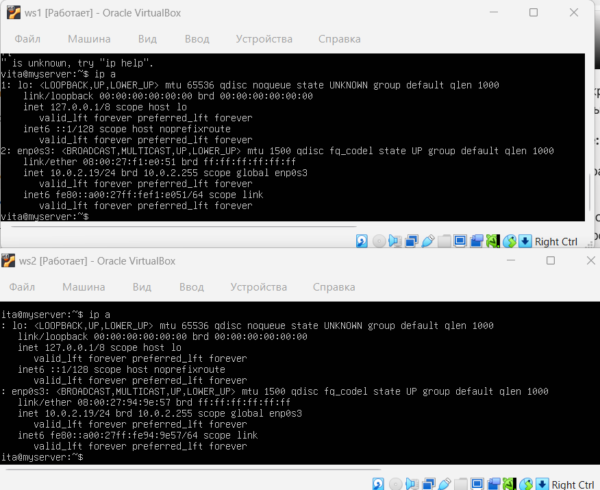

* Настройка сетевых интерфейсов в файлах конфигурации Netplan:
  * Содержимое измененного файла `/etc/netplan/00-installer-config.yaml
    * 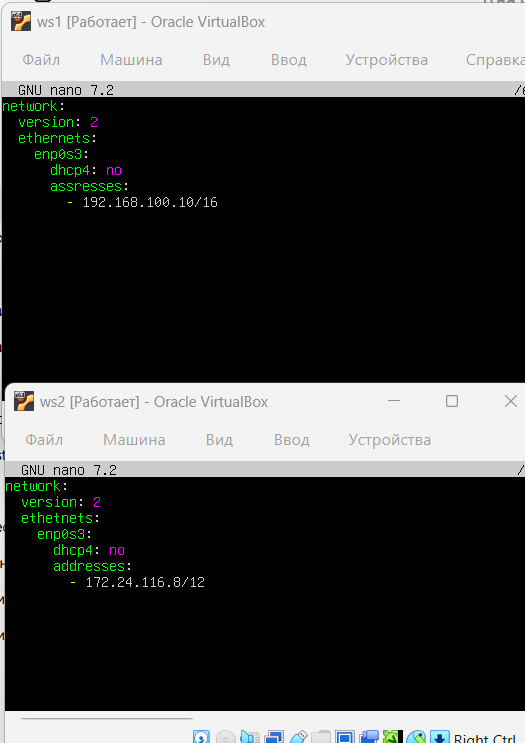

* Перезапуск сетевого сервиса с помощью команды `netplan apply`:
  * 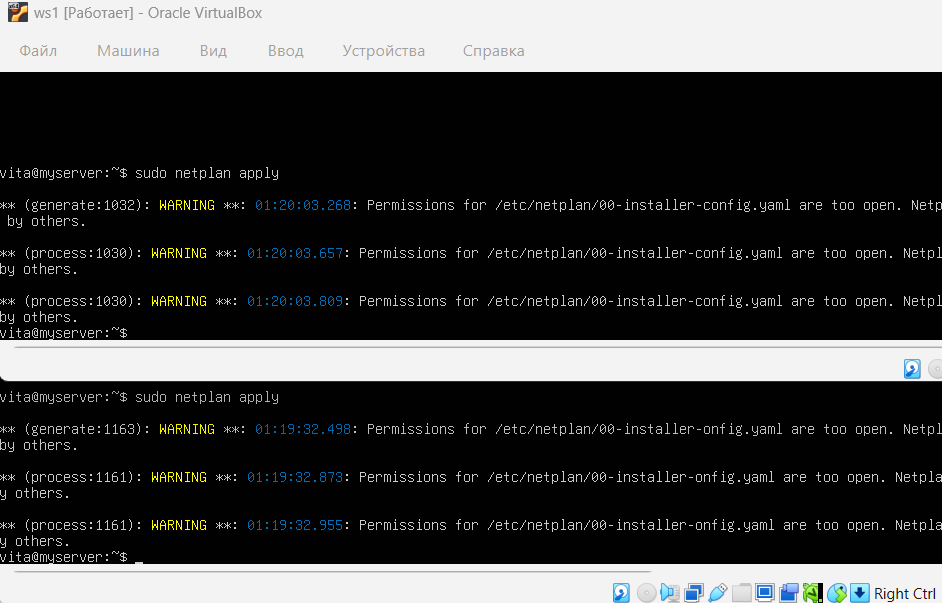

### 2.1. Добавление статического маршрута вручную
* Добавление статических маршрутов через команду `ip route add` и проверка связи:
  * Маршрут на **ws1** добавлен командой: `sudo ip route add 172.24.116.8 dev enp0s3`
  * Маршрут на **ws2** добавлен командой: `sudo ip route add 192.168.100.10 dev enp0s3`
  * Успешный пинг между машинами:
    * 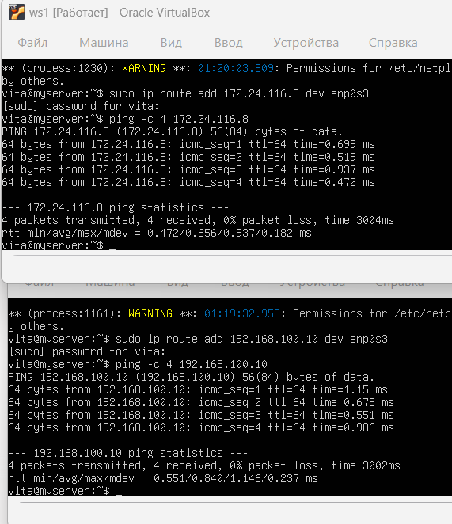

### 2.2. Добавление статического маршрута с сохранением
* Статические маршруты добавлены в конфигурационные файлы Netplan, чтобы они сохранялись после перезагрузки:
  * Содержимое файла `/etc/netplan/00-installer-config.yaml` 
    * 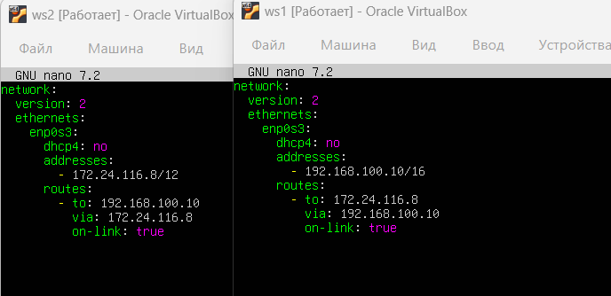
* Проверка связи после перезагрузки машин и применения настроек `sudo netplan apply`:
  * Успешный пинг между **ws1** и **ws2**:
    * 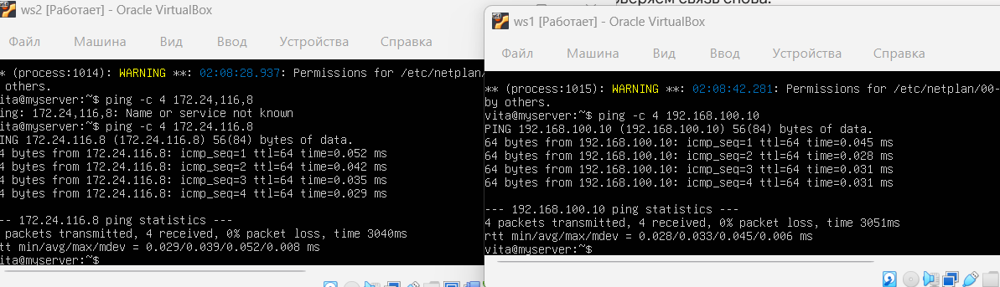

## Part 3. Утилита iperf3

### 3.1. Скорость соединения
* Перевод единиц измерения скорости:
  * 8 Mbps = **1 MB/s**
  * 100 MB/s = **800000 Kbps**
  * 1 Gbps = **1000 Mbps**

### 3.2. Утилита iperf3
* Измерение скорости соединения между машинами ws1 и ws2:
  * Машина **ws1** запущена в режиме сервера командой `iperf3 -s`.
  * Машина **ws2** запущена в режиме клиента командой `iperf3 -c 192.168.100.10`.
  * 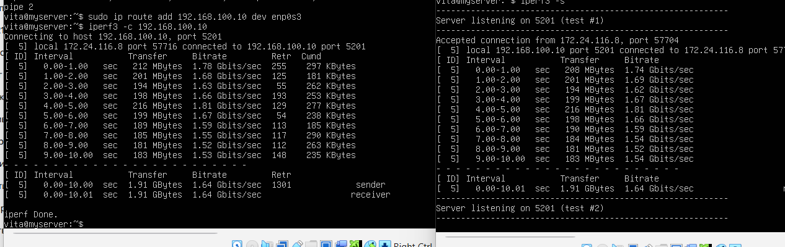
  
  
## Part 4. Сетевой экран

### 4.1. Утилита iptables
* Содержимое файлов `/etc/firewall.sh`:
  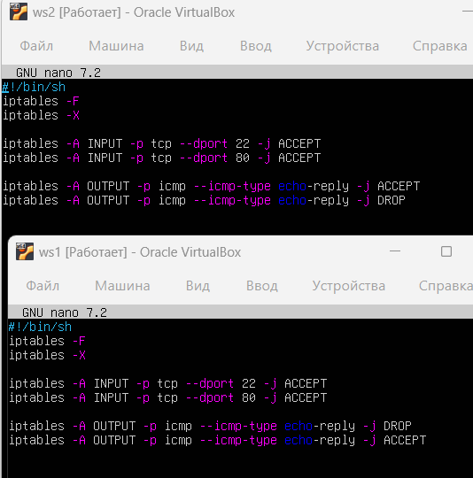

* Запуск файлов конфигурации сетевого экрана на обеих машинах:
  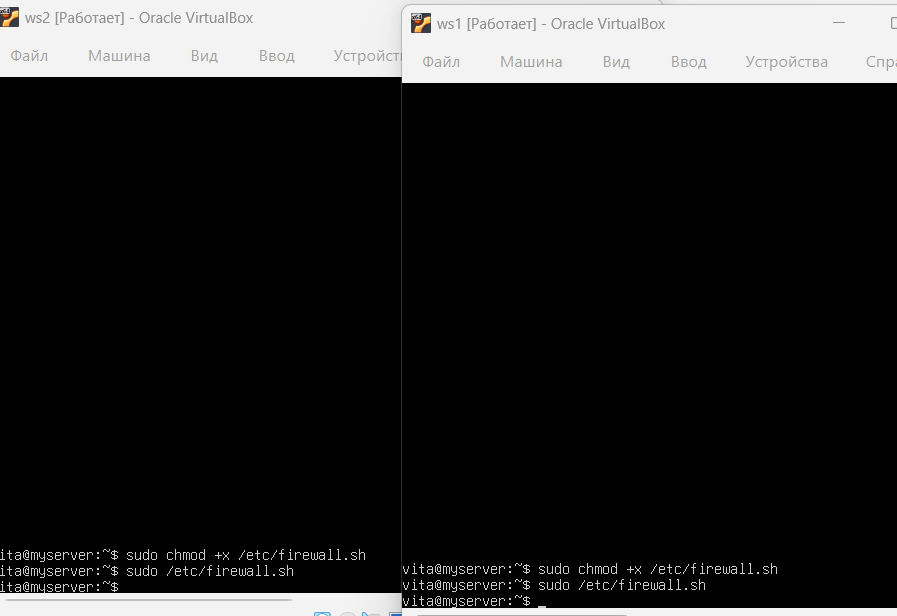

* **Разница между стратегиями:**
  В утилите `iptables` правила выполняются сверху вниз до первого совпадения. 
  * На **ws1** первым было указано запрещающее правило (`DROP`), поэтому пакеты `echo-reply` блокируются файрволом, и машина перестает пинговаться. До идущего следом разрешающего правила цепочка просто не доходит.
  * На **ws2**, наоборот, первым стояло разрешающее правило (`ACCEPT`). Пакет обрабатывается им и успешно улетает в сеть, а нижнее запрещающее правило игнорируется. Машина продолжает пинговаться.

### 4.2. Утилита nmap
* Попытка запустить `ping` с ws2 на ws1 (машина не пингуется из-за блокировки на OUTPUT):

* Проверка доступности хоста с помощью утилиты `nmap` (подтверждение статуса `Host is up`):
  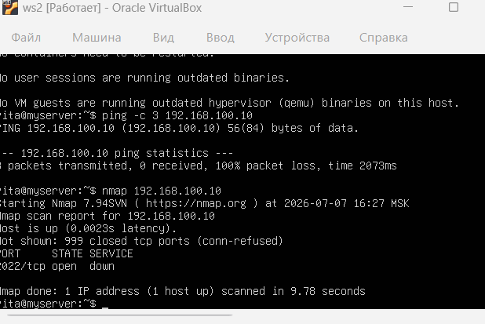
  
  
## Part 5. Статическая маршрутизация сети

### 5.1. Настройка адресов машин
* Конфигурационные файлы Netplan для всех машин сети:
  * [Конфигурация](screenshots/Screenshot 2026-07-09 031451.png)
* Проверка корректности адресов с помощью `ip -4 a` и успешное выполнение пингов:
  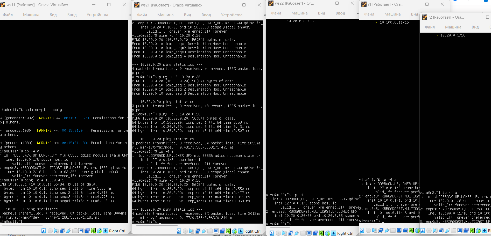

### 5.2. Включение переадресации IP-адресов
* Включение форвардинга на роутерах r1 и r2:
  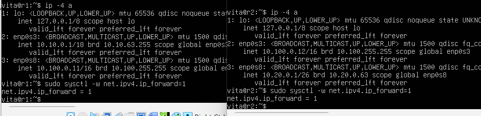
* Конфигурационный файл `/etc/sysctl.conf` с перманентным включением:
  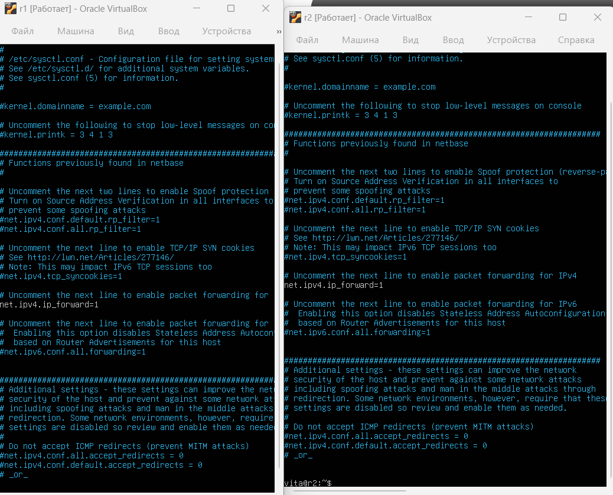

### 5.3. Установка маршрута по умолчанию
* Конфигурационные файлы Netplan рабочих станций с блоками `routes` (default):
  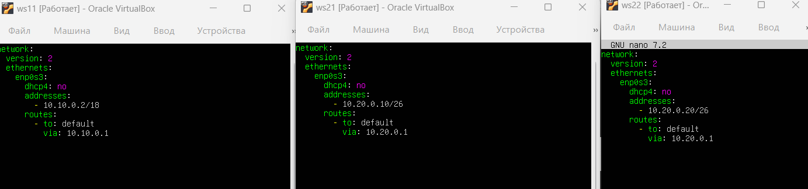
* Вывод команды `ip r`, подтверждающий добавление статического шлюза `default via`:
  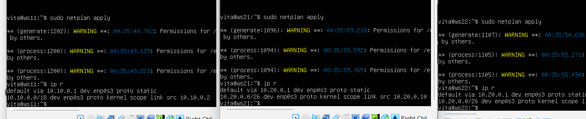
* Перехват трафика командой `tcpdump` на r2 при пинге с ws11:
  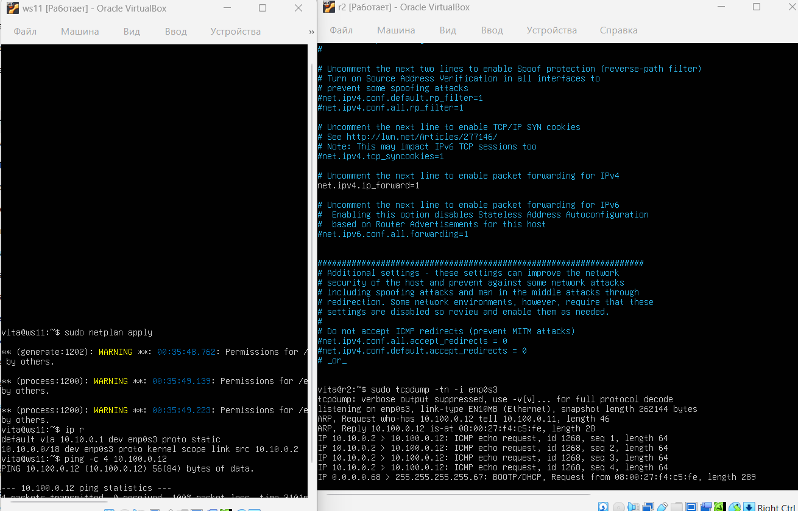

### 5.4. Добавление статических маршрутов
* Конфигурационные файлы Netplan для роутеров r1 и r2 с новыми маршрутами:
  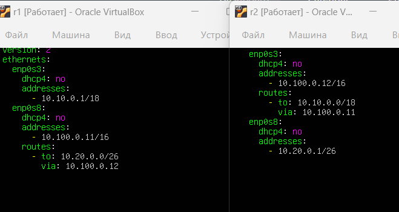
* Таблицы маршрутизации на обоих роутерах:
  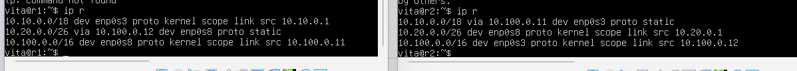
* Вывод команд `ip r list` на ws11:
  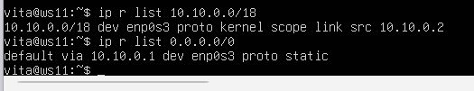
* **Объяснение выбора маршрута:** Маршрутизатор в Linux руководствуется правилом Longest Match Prefix — совпадение по наиболее длинной маске сети. Так как маска подсети `/18` длиннее (точнее) маски маршрута по умолчанию `/0`, пакеты в локальную сеть уходят напрямую через интерфейс, минуя шлюз.

### 5.5. Построение списка маршрутизаторов
* Вывод утилиты `traceroute` от ws11 до ws21 и параллельный дамп `tcpdump` на r1:
  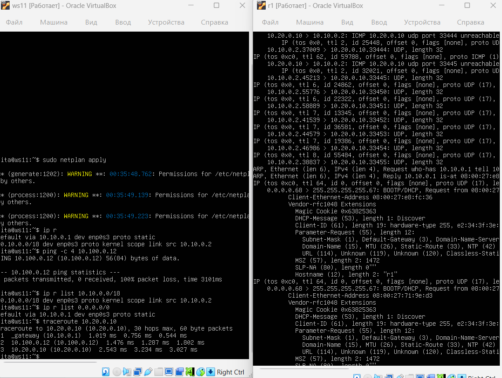
* **Принцип работы traceroute:** Утилита отправляет пакеты с последовательным увеличением значения TTL (1, 2, 3...). Каждый транзитный узел уменьшает TTL на единицу. При TTL=0 роутер отбрасывает пакет и генерирует ICMP-сообщение типа 11 (Time Exceeded), возвращая его отправителю. По адресам этих ответов traceroute поэтапно определяет структуру пути.

### 5.6. Использование протокола ICMP при маршрутизации
* Перехват сетевого ICMP-трафика на r1 при пинге несуществующего адреса `10.30.0.111` с ws11:
  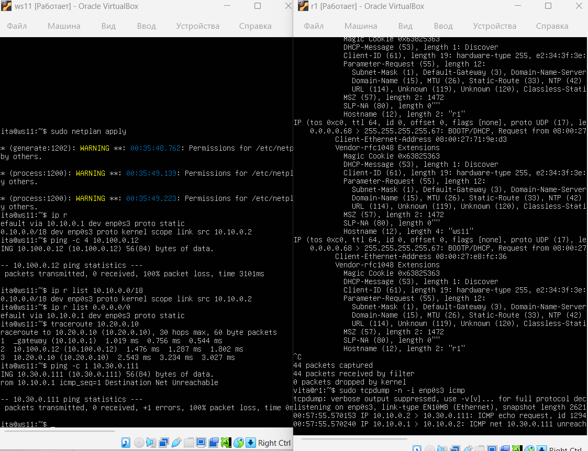
  
  # Part 6. Динамическая настройка DHCP

## 6.1. Настройка DHCP-сервера на r2

*  Установка DHCP-сервера на маршрутизатор **r2**:
   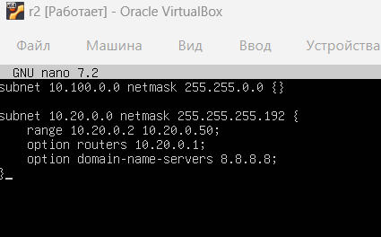
   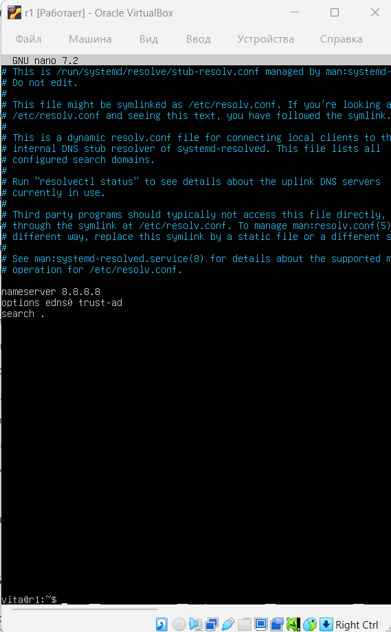
   
*  ws22 с ws21:
   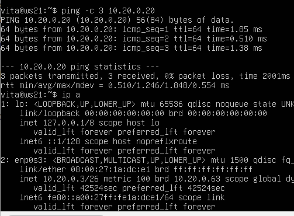   
* измененный конфиг вс11
   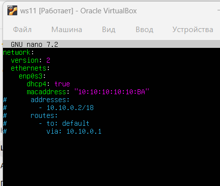  
* Для r1 настрой аналогично r2, но сделай выдачу адресов с жесткой привязкой к MAC-адресу (ws11). Проведи аналогичные тесты.
*  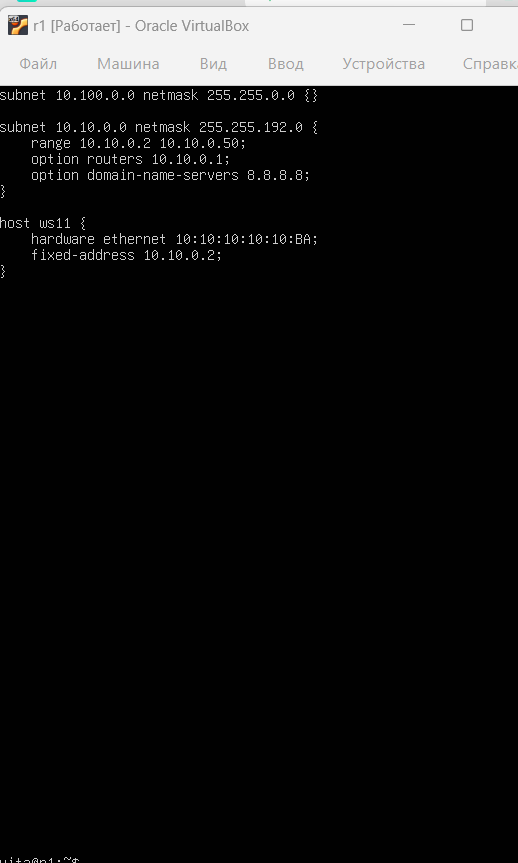  
*  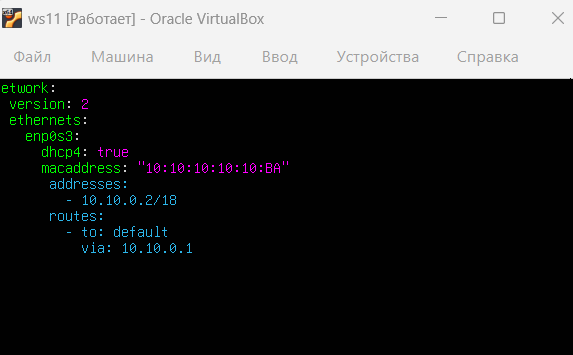  
*  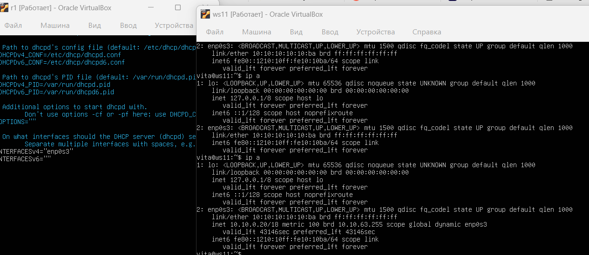 

* Запроси с ws21 обновление IP-адреса. В отчёте помести скрины IP до и после обновления. В отчёте опиши, какими опциями DHCP сервера пользовался в данном пункте. 
*  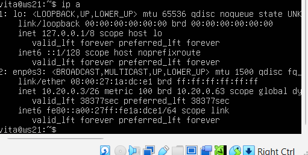  
*  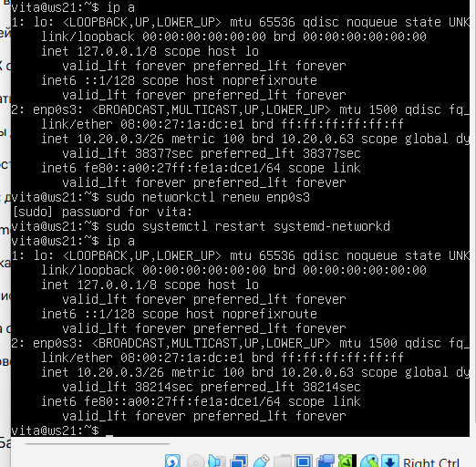  
В этом пункте были использованы следующие основные опции и директивы DHCP-сервера:

subnet ... netmask ... — задает подсеть и маску, в пределах которой работает DHCP-сервер.

range — определяет диапазон динамических IP-адресов, доступных для свободной выдачи клиентам.

option routers — указывает адрес шлюза по умолчанию (Default Gateway) для клиентов.

option domain-name-servers — передает клиентам адреса DNS-серверов (в нашем случае 8.8.8.8).

host [имя] — директива объявления статического хоста для фиксированной выдачи параметров.

hardware ethernet — опция, указывающая конкретный физический MAC-адрес сетевой карты клиента, по которому сервер его идентифицирует.

fixed-address — жестко закрепляет конкретный IP-адрес за указанным выше MAC-адресом, исключая его из общей динамической раздачи.

## Part 7. NAT

### 1. Настройка Apache2
Изменила строку `Listen 80` на `Listen 0.0.0.0:80` в файле `/etc/apache2/ports.conf` на машинах **ws22** и **r1**, сделав сервер общедоступным.

Содержимое измененного файла `/etc/apache2/ports.conf`:
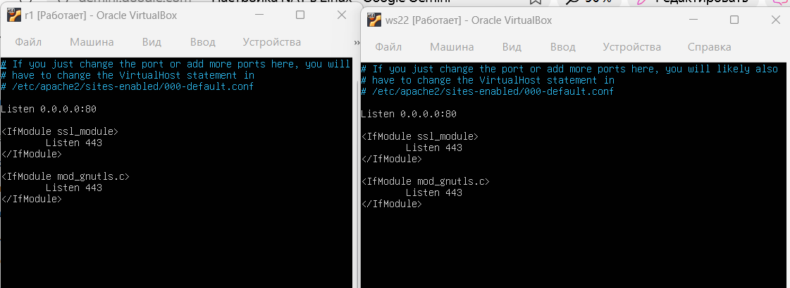

Запустила веб-сервер Apache командой `service apache2 start` на **ws22** и **r1**:

---

### 2. Базовый фаервол на r2 (Запрет FORWARD)
Создала скрипт фаервола на **r2** со следующими правилами:
1) Удаление правил в таблице filter — `iptables -F`
2) Удаление правил в таблице NAT — `iptables -F -t nat`
3) Отбрасывать все маршрутизируемые пакеты — `iptables --policy FORWARD DROP`

После запуска скрипта проверил соединение между **ws22** и **r1** командой `ping`. Машины не пингуются:
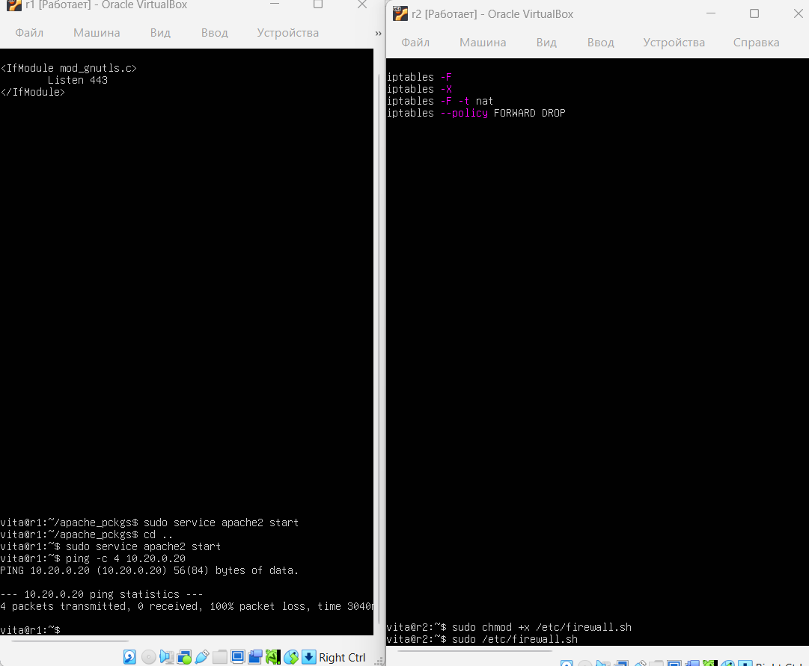

---

### 3. Разрешение маршрутизации ICMP
Добавила в файл фаервола на **r2** правило:
4) Разрешить маршрутизацию всех пакетов протокола ICMP (`iptables -A FORWARD -p icmp -j ACCEPT`)

После перезапуска скрипта проверила соединение командой `ping`. Машины успешно пингуются:
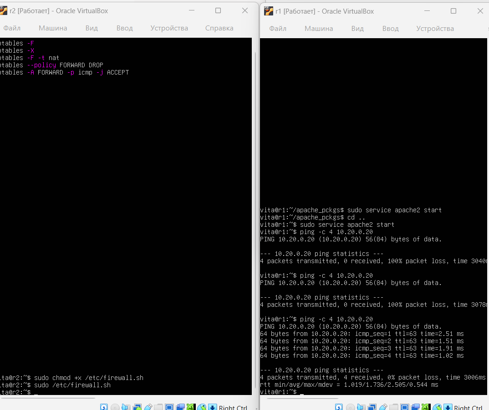

---

### 4. Настройка SNAT и DNAT
Добавил в файл фаервола на **r2** правила для настройки SNAT и DNAT, а также сопутствующие правила фильтрации в цепочке `FORWARD`:

Содержимое финального файла фаервола на **r2**:
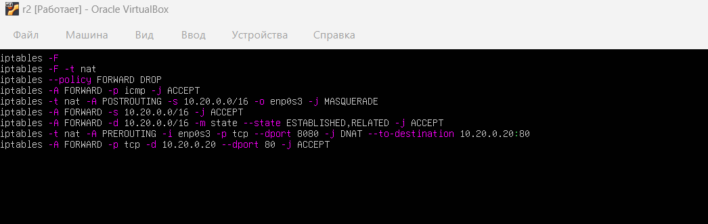

---

### 5. Тестирование соединений через Telnet

**Проверка SNAT и DNAT
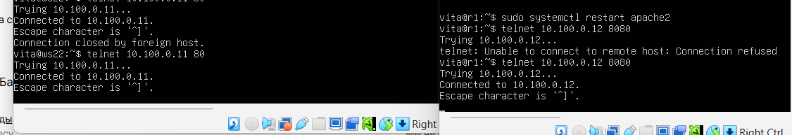